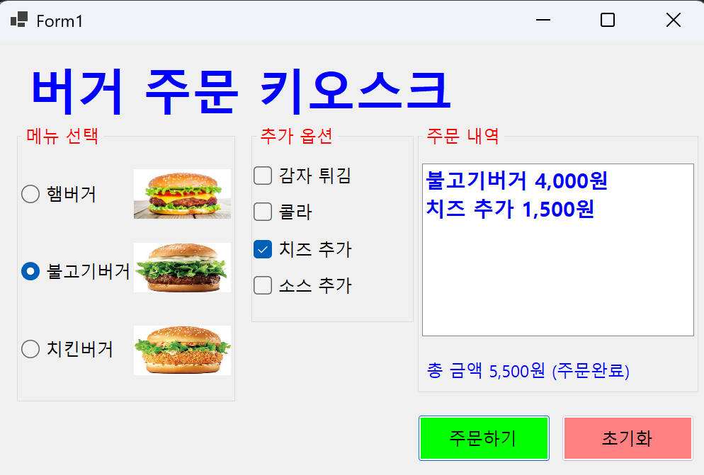
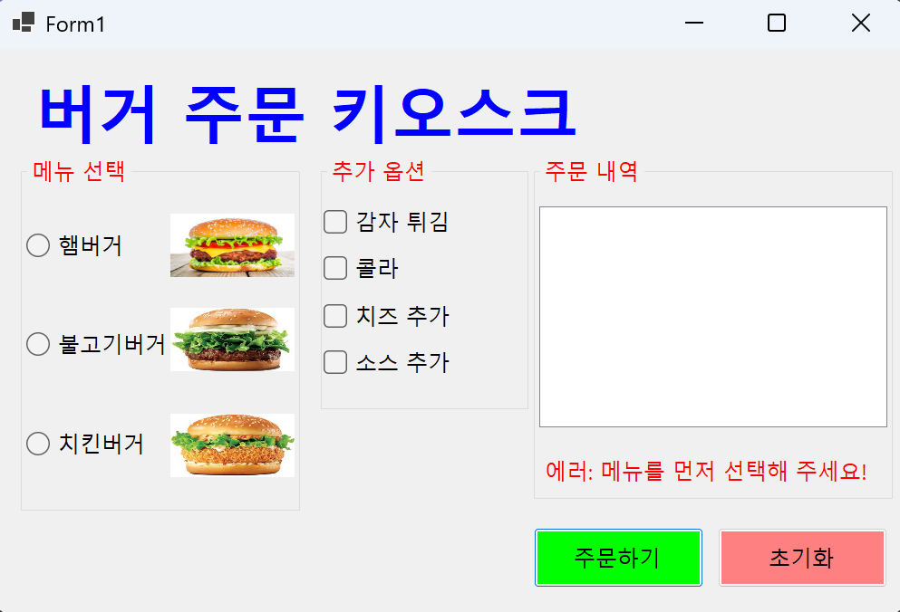
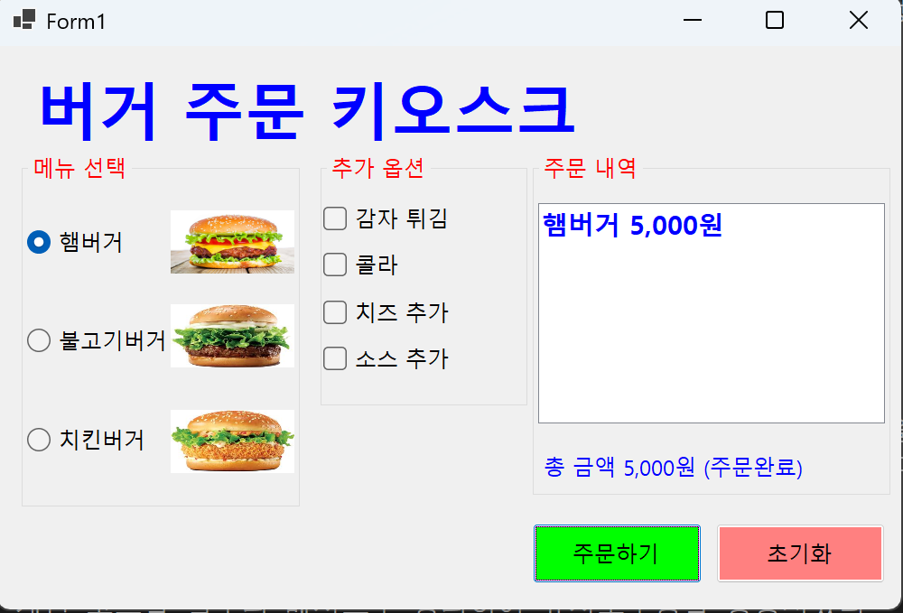
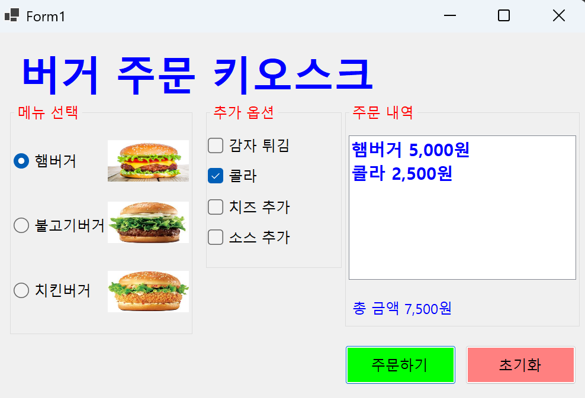

# BurgerKiosk

# (C# 코딩) BurgerKiosk

## 개요
- C# 프로그래밍 학습
- 1줄 소개: 사용자 친화적인 UI와 실시간 금액 계산 기능을 갖춘 윈도우 폼 기반 햄버거 키오스크 프로그램
- 사용한 플랫폼:
  - C#, .NET Windows Forms, Visual Studio, GitHub
- 사용한 컨트롤:
  - 입력: RadioButton (rdoBuger, rdoBulggogi, rdoChicken), CheckBox (chkFriedChips, chkCoke, chkCheese, chkSource), Button (btnOrder, btnClear)
  - 출력: ListBox (lbOrderList), Label (lblTotal)
  - 컨테이너: GroupBox (gpSelectBuger, gpOptions, gpOrderList), PictureBox (pcBuger, pcBulggogi, pcChicken)
- 사용한 기술과 구현한 기능:
  - if-else if 문을 활용한 단일 메뉴 선택 로직 구현
  - 개별 if 문을 활용한 다중 옵션 중복 선택 및 금액 누적 로직 구현
  - UpdateOrderInfo() 공통 메서드 추출을 통한 코드 재사용성 향상
  - CheckedChanged 이벤트를 활용한 실시간 정보 업데이트 시스템
  - ForeColor 및 Text 속성 제어를 통한 동적 에러 메시지 라벨 구현
  - 문자열 보간($) 및 숫자 형식 지정자(:N0)를 이용한 천 단위 콤마 출력
  - AcceptButton 속성 설정을 통한 Enter 키 주문 실행 기능

## 실행 화면 (과제1)
- 주문하기와 초기화로 주문 구성
- 과제1 코드의 실행 스크린샷  

- 과제 내용
  - 라디오 버튼을 이용한 버거 메뉴 선택 기능을 구현합니다.
  - 체크박스를 이용한 사이드 메뉴 및 옵션 다중 선택 기능을 구현합니다.
  - 주문하기 버튼 클릭 시 리스트박스에 상세 내역을 출력합니다.
  - 초기화 버튼 클릭 시 모든 선택 항목을 해제하고 초기 상태로 설정합니다.

- 구현한 내용 (위 그림 참조)
  - RadioButton.Checked 속성을 판별하여 단일 선택된 메뉴와 가격을 할당했다.
    사용한 코드: `if (rdoBuger.Checked) { totalCost += 5000; lbOrderList.Items.Add("햄버거 5,000원"); }`
  - CheckBox는 중복 선택이 가능하므로 각각 독립적인 if 문으로 처리하여 금액을 누적했다.
    사용한 코드: `if (chkCoke.Checked) { totalCost += 2500; lbOrderList.Items.Add("콜라 2,500원"); }`
  - ListBox 컨트롤을 사용하여 사용자가 선택한 메뉴와 옵션 목록을 시각화했다.
    사용한 코드: `lbOrderList.Items.Clear(); lbOrderList.Items.Add(...);`
  - 초기화 버튼 클릭 시 모든 컨트롤의 상태를 초기화하도록 구현했다.
    사용한 코드: `rdoBuger.Checked = false; chkCoke.Checked = false; lbOrderList.Items.Clear();`

## 실행 화면 (과제2)
- 아무 내용 없이 주문시 오류 메시지 나오게 함
- 과제2 코드의 실행 스크린샷  

- 과제 내용
  - 메뉴(버거) 미선택 시 주문이 진행되지 않도록 유효성 검사 로직을 구현합니다.
  - 메시지 박스 대신 화면 내 Label(lblTotal)을 이용하여 에러 메시지를 전달합니다.
  - 정상 주문 시 에러 메시지가 사라지고 다시 합계 금액이 표시되도록 제어합니다.

- 구현한 내용 (위 그림 참조)
  - 논리 부정 연산자(!)를 사용하여 필수 항목인 버거 선택 여부를 검사했다.
    사용한 코드: `if (!rdoBuger.Checked && !rdoBulggogi.Checked && !rdoChicken.Checked)`
  - 유효성 검사 실패 시 return 키워드로 하단 계산 로직 실행을 즉시 차단했다.
    사용한 코드: `lblTotal.Text = "에러: 메뉴를 먼저 선택해 주세요!"; return;`
  - ForeColor 속성을 Color.Red로 변경하여 사용자에게 시각적 경고를 제공했다.
    사용한 코드: `lblTotal.ForeColor = Color.Red;`
  - 정상적인 로직 진입 시 다시 색상을 복구하여 사용자 경험을 유지했다.
    사용한 코드: `lblTotal.ForeColor = Color.Blue;`

## 실행 화면 (과제3)
- 과제3 코드의 실행 스크린샷
- 탭키와 스페이스 엔터키로 이동

- 과제 내용
  - Tab 키를 이용한 컨트롤 간 포커스 이동 순서를 논리적으로 최적화합니다.
  - 어느 위치에서든 Enter 키를 누르면 주문 버튼이 실행되도록 설정합니다.
  - 금액 출력 시 천 단위 콤마(,)를 적용하여 가독성을 높입니다.

- 구현한 내용 (위 그림 참조)
  - 디자인 창의 TabIndex 속성을 메뉴-옵션-버튼 순서로 정렬하여 키보드 접근성을 높였다.
  - 폼의 AcceptButton 속성에 btnOrder를 연결하여 엔터 키 단축키를 구현했다.
    사용한 코드: `this.AcceptButton = btnOrder;`
  - 숫자 형식 지정자(:N0)를 사용하여 수동 연산 없이 통화 단위를 표현했다.
    사용한 코드: `lblTotal.Text = $"총 금액 {totalCost:N0}원";`

## 실행 화면 (과제4)
- 과제4 코드의 실행 스크린샷
- 추가할때마다 리스트박스로 실시간 변경

- 과제 내용
  - 버튼 클릭 없이 항목을 선택/해제하는 즉시 결과가 반영되는 실시간 시스템을 구현합니다.
  - 코드 중복을 피하기 위해 계산 로직을 공통 메서드로 추출(Refactoring)합니다.
  - 모든 선택 컨트롤의 이벤트를 공통 메서드에 연결합니다.

- 구현한 내용 (위 그림 참조)
  - 반복되는 계산 코드를 별도의 메서드로 정의하여 유지보수성을 향상시켰다.
    사용한 코드: `private void UpdateOrderInfo(object sender, EventArgs e) { ... }`
  - 생성자에서 멀티캐스트 델리게이트를 통해 여러 컨트롤의 이벤트를 통합 관리했다.
    사용한 코드: `rdoBuger.CheckedChanged += UpdateOrderInfo; chkCoke.CheckedChanged += UpdateOrderInfo;`
  - 최종 주문 완료 시 기존 금액 텍스트에 상태 문구를 추가로 결합하여 정보를 제공했다.
    사용한 코드: `lblTotal.Text += " (주문완료)";`
